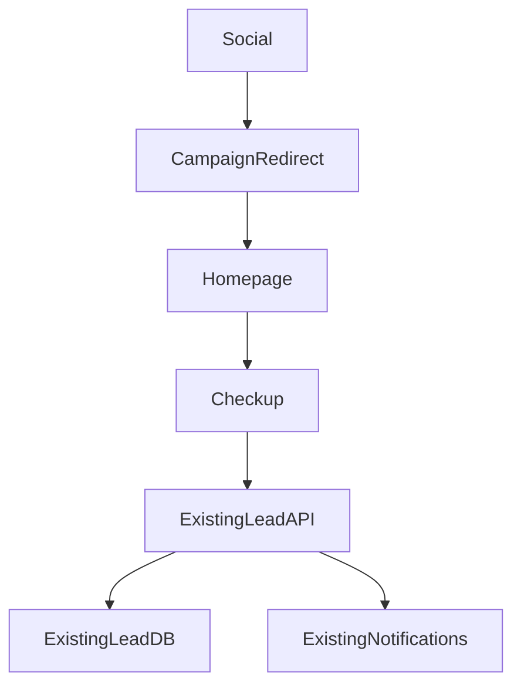

# Business Checkup — Existing Codebase Feasibility & Integration Investigation

## Role

You are the implementation agent currently working on the IMAD Consulting Studio website and its supporting backend.

Your task in this phase is **investigation only**.

Do **NOT** implement the Business Checkup, modify production code, refactor the architecture, change the database schema, alter the live funnel, or deploy anything.

Your job is to thoroughly inspect the existing system and determine:

> **How can the proposed Business Checkup / diagnostic lead-generation experience be integrated into the existing codebase with the smallest practical change set, while preserving the current architecture and live functionality?**

Your findings will be handed back to ChatGPT for architectural review before any implementation begins.

---

# 1. Existing Business Context

The website currently has:

```text
Work
Experience
Contact
Blog
```

The site is intentionally already fairly dense, so we do **not** want to turn it into a collection of separate tools.

The proposed direction is a single unified visitor-facing experience:

> **Business Checkup**

Internally, this could eventually cover:

```text
Business Health
Website Health
Email Deliverability
WhatsApp Readiness
AI-generated Business Report
```

These should NOT automatically become five separate pages, five navigation items, or five independent applications.

The intended concept is:

```text
Visitor
   │
   ▼
Business Checkup
   │
   ├── Website
   ├── Email
   ├── WhatsApp
   └── General Business / Technology
           │
           ▼
     Personalised Report
           │
           ▼
     Contact / WhatsApp
```

However, **do not assume this architecture is technically appropriate until you inspect the actual codebase.**

Your job is to determine what the existing system can support naturally.

---

# 2. Existing Live Funnel

The current production funnel has already been implemented.

Current behaviour:

```text
WhatsApp Status / Social Media / QR
              │
              ▼
https://api.imadconsulting.co.uk/r/status?campaign=ep001
              │
              ├── campaign click logged
              │
              ▼
          Homepage
              │
              ▼
       ?utm_source=status
       ?utm_campaign=ep001
              │
              ▼
Hero CTA changes from:

"View My Projects"

to:

"Tell me your problem"

              │
              ▼
           Contact
              │
              ▼
Name
Email
Problem
              │
              ▼
       Lead API / database
              │
       ┌──────┴──────┐
       ▼             ▼
    Telegram        Email
       │
       ▼
    PostgreSQL
```

The existing implementation reportedly includes:

- campaign tracking
- `utm_source`
- `utm_campaign`
- hidden `source_campaign`
- lead storage
- PostgreSQL
- idempotency key
- honeypot
- `X-Form-Secret`
- Telegram notification
- email notification
- legacy WordPress AJAX email path
- dead-letter handling
- follow-up monitoring
- `/healthz`
- conditional hero CTA

The live API health check has previously returned:

```json
{
  "status": "ok"
}
```

Do not assume any of these details are still exactly as described.

**Verify them against the actual codebase and deployed configuration where possible.**

---

# 3. Primary Investigation Question

Answer this question:

> **What is the smallest, safest and most maintainable way to introduce a Business Checkup into the existing system without causing a general architectural overhaul?**

We are specifically trying to avoid:

- replacing the current contact system
- replacing the current campaign tracking
- replacing the existing lead API
- creating a second lead database
- creating a second notification system
- introducing unnecessary frameworks
- introducing unnecessary SaaS dependencies
- rebuilding the website
- rewriting the existing frontend
- redesigning the current homepage
- duplicating existing functionality
- breaking existing social-media campaign attribution
- breaking the existing contact form
- breaking the existing WordPress fallback
- introducing n8n
- creating a new orchestration layer

The preferred solution is **incremental integration**.

---

# 4. Investigation Rules

## IMPORTANT: READ ONLY

During this investigation:

### You MUST NOT:

- edit files
- create files
- delete files
- modify database schemas
- run migrations
- modify production configuration
- restart services
- deploy anything
- change DNS
- change API routes
- modify frontend behaviour
- modify the live funnel

You may run diagnostic/read-only commands.

If you believe a modification is absolutely necessary to determine something, stop and report what you need rather than making the change.

---

# 5. Inspect the Entire Relevant Architecture

First map the existing system.

Identify:

### Frontend

Determine:

- framework
- language
- build system
- frontend entry points
- routing mechanism
- homepage implementation
- contact implementation
- Blog implementation
- existing component structure
- CSS architecture
- JavaScript architecture
- animation system
- existing form handling
- state management
- API communication
- environment/configuration handling

Pay particular attention to whether introducing something like:

```text
/business-checkup
```

would fit naturally into the current routing architecture.

If the site does not use application routing, determine whether the safest approach would instead be:

```text
/business-checkup/
```

or another existing pattern.

Do not recommend a new routing framework unless there is a genuine architectural reason.

---

# 6. Inspect the Current Contact Funnel

Trace the complete implementation.

Find:

- hero CTA code
- UTM detection
- CTA swapping
- contact form markup
- contact JavaScript
- hidden attribution fields
- API calls
- authentication/secret mechanism
- idempotency handling
- honeypot handling
- error handling
- legacy WordPress fallback
- success states
- failure states

Document the actual request flow.

For example:

```text
Browser
  ↓
contact.js
  ↓
API endpoint
  ↓
validation
  ↓
database
  ↓
notification
```

But use the **actual architecture you find**, not this example.

Identify exactly where a Business Checkup could hook into this flow.

---

# 7. Inspect the Backend

Determine:

- backend framework
- API structure
- route organisation
- service layer
- database layer
- models
- schemas
- validation
- authentication
- configuration
- logging
- error handling
- notification mechanisms
- background jobs
- existing lead endpoints
- existing campaign endpoints

Pay particular attention to whether the existing backend already has reusable abstractions for:

```text
Lead
Campaign
Contact
Submission
Notification
Attribution
```

Determine whether the Business Checkup can reuse these.

---

# 8. Inspect the Database

Map the existing lead-related schema.

Determine:

- database engine
- relevant tables
- columns
- indexes
- constraints
- relationships
- migrations
- timestamps
- status fields
- campaign attribution
- notification state
- idempotency handling

Answer:

### Question A

Can Business Checkup results be stored using the existing `leads` structure without modification?

### Question B

If not, what is the **minimum schema addition** required?

### Question C

Could the checkup answers/report simply be stored as structured JSON associated with an existing lead?

For example, investigate whether something conceptually like:

```text
diagnostic_data JSONB
```

would fit the existing architecture.

Do NOT implement it.

Determine whether this would actually be appropriate.

---

# 9. Investigate Lead Lifecycle

Understand how a lead currently moves through the system.

For example:

```text
Submitted
   ↓
Stored
   ↓
Notification
   ↓
Contacted
   ↓
Follow-up
```

Find the actual states.

Determine whether the Business Checkup can simply become another way of creating the same lead rather than creating an entirely separate lead entity.

This is a key architectural question.

---

# 10. Investigate Campaign Attribution

Trace:

```text
/r/status
```

and all related campaign handling.

Determine:

- where campaign clicks are recorded
- how UTM parameters are generated
- how they reach the homepage
- how they survive navigation
- how they reach the contact form
- how they reach the API
- how attribution is stored

Then determine:

> Can the same attribution mechanism survive a Business Checkup flow without modification?

For example:

```text
Social Campaign
      ↓
Homepage
      ↓
Business Checkup
      ↓
Result
      ↓
Lead
```

The campaign should ideally remain attached to the eventual lead.

If the current architecture makes this difficult, explain exactly why.

---

# 11. Investigate Frontend Integration Options

Determine which of these would fit the existing codebase best:

### Option A

A dedicated page:

```text
/business-checkup
```

### Option B

A modal/drawer launched from the homepage.

### Option C

A section embedded into the existing homepage.

### Option D

A hybrid approach.

Do not decide based purely on aesthetics.

Inspect the existing architecture and explain the technical implications of each.

We are particularly concerned about:

- bundle size
- routing
- animation conflicts
- CSS conflicts
- state management
- mobile behaviour
- accessibility
- page performance
- maintainability

Then identify which approach requires the **least invasive change**.

---

# 12. Investigate Whether Existing UI Components Can Be Reused

Inventory reusable components.

Look for existing:

- buttons
- cards
- forms
- inputs
- radio controls
- progress indicators
- modals
- typography
- animations
- transitions
- loaders
- success/error states

Determine whether Business Checkup can use these components.

We do NOT want another visual system.

The diagnostic should look like it belongs to IMAD Consulting.

---

# 13. Investigate Existing Design System

Document:

- fonts
- typography
- colours
- spacing
- buttons
- cards
- borders
- shadows
- responsive breakpoints
- animation libraries
- existing GSAP usage
- existing ScrollTrigger usage
- global CSS
- component-level CSS

Pay particular attention to the current hero implementation.

Do NOT modify the hero.

We need to know whether introducing a checkup interaction could interfere with existing GSAP/ScrollTrigger behaviour.

---

# 14. Investigate Existing Analytics / Tracking

Find existing tracking mechanisms.

Determine whether the system already records:

- page visits
- campaign clicks
- CTA clicks
- form starts
- form submissions
- errors
- conversions

If none exist, document that.

Then determine the smallest way to eventually add:

```text
checkup_started
question_answered
checkup_completed
report_viewed
contact_clicked
whatsapp_clicked
```

Do not implement analytics now.

---

# 15. Investigate WhatsApp Integration

We currently intentionally do NOT automate WhatsApp Status.

Do not propose automating WhatsApp Status.

Instead investigate the eventual handoff:

```text
Business Checkup
      ↓
Result
      ↓
"Continue on WhatsApp"
```

Determine whether the existing website already has:

- WhatsApp links
- click tracking
- campaign attribution
- phone number configuration
- reusable CTA components

Determine what can be reused.

---

# 16. Investigate AI Integration

The proposed:

> AI Business Report Generator

should not automatically become a new AI service.

Investigate whether the current system already has:

- AI providers
- API clients
- model configuration
- backend AI utilities
- environment variables
- OpenRouter integration
- OpenAI-compatible interfaces
- existing report-generation infrastructure

If none exist, say so.

Then evaluate whether the first version of the Business Checkup could operate **without AI**.

This is important.

We may want:

```text
Phase 1

Deterministic questions
       ↓
Rules / scoring
       ↓
Template-based report
```

and only later:

```text
Phase 2

Structured diagnostic data
       ↓
AI
       ↓
Personalised narrative
```

Determine whether that incremental architecture fits the existing codebase.

---

# 17. Evaluate the Five Proposed Capabilities

For each of these:

1. Business Health Assessment
2. Website Health Checker
3. Email Deliverability Checker
4. WhatsApp Readiness Assessment
5. AI Business Report Generator

determine:

- what can be implemented using existing infrastructure
- what requires new backend logic
- what requires new frontend logic
- what requires database changes
- what requires external APIs
- what can initially be deterministic
- what should be deferred
- what could create unnecessary complexity

Create a table:

| Capability | Existing Infrastructure Reusable? | New Backend? | New DB? | New Frontend? | External Dependency? | Complexity |
|---|---|---|---|---|---|---|

Do not use subjective ratings such as "good/bad".

Use concrete engineering descriptions.

---

# 18. Determine the MVP Boundary

Based on the actual codebase, propose the smallest viable implementation.

The MVP should ideally be something close to:

```text
Business Checkup
      ↓
6–8 questions
      ↓
Simple deterministic assessment
      ↓
Personalised result
      ↓
Existing lead capture
      ↓
Existing notification pipeline
```

But this is only a starting hypothesis.

If the codebase suggests an even smaller or safer MVP, recommend it.

If something here is technically inappropriate, explain why.

---

# 19. Identify the Best Integration Point

Give a concrete recommendation for where the Business Checkup should live.

For example:

```text
Frontend:
src/...
      ↓
existing router
      ↓
/business-checkup
```

and:

```text
Backend:
existing API
      ↓
new / existing route
      ↓
existing lead service
```

Use the actual repository structure.

Reference real files and directories.

Do not invent paths.

---

# 20. Minimise Architectural Change

Classify every proposed modification as:

### Reuse

Existing code can be used unchanged.

### Extend

Existing code needs a small additive change.

### New

A genuinely new component/service/module is required.

### Replace

Existing architecture would have to be replaced.

Our preferred result is:

```text
Reuse > Extend > New > Replace
```

Do not force everything into "reuse" if that would create poor architecture.

Explain every `New` or `Replace`.

---

# 21. Look Specifically for Hidden Risks

Investigate potential conflicts involving:

- WordPress
- existing API
- existing lead database
- legacy AJAX
- UTM persistence
- duplicate submissions
- idempotency
- CSRF/CORS
- secrets
- rate limiting
- spam
- honeypot
- database migrations
- existing background jobs
- deployment process
- caching
- CDN
- reverse proxy
- routing
- frontend build process
- GSAP
- responsive design
- browser compatibility

Identify anything that could make the proposed checkup more complicated than it initially appears.

---

# 22. Do Not Build a Separate System Unless Necessary

Explicitly investigate whether we can avoid:

```text
New frontend application
New backend service
New database
New authentication system
New notification service
New analytics platform
New CRM
New workflow engine
```

The default assumption should be:

> **Extend the existing IMAD system.**

A separate service should only be recommended if the existing architecture genuinely cannot support the feature cleanly.

---

# 23. Produce an Architecture Diagram

After investigation, produce a Mermaid diagram showing the **existing architecture** and where the proposed Business Checkup could fit.

Use actual components discovered in the repository.

For example, conceptually:



But replace these with the actual names/components found.

---

# 24. Produce a Change-Surface Map

Create a table:

| Area | Existing File/Module | Proposed Change | Risk | Can Avoid Change? |
|---|---|---|---|---|
| Homepage | actual path | ... | ... | ... |
| Contact | actual path | ... | ... | ... |
| API | actual path | ... | ... | ... |
| Database | actual migration/model | ... | ... | ... |
| Campaign tracking | actual path | ... | ... | ... |
| Notifications | actual path | ... | ... | ... |

Again, use actual repository paths.

---

# 25. Production-Safety Assessment

Determine whether the proposed architecture can be introduced incrementally.

Specifically answer:

### Can we:

- add the checkup without changing existing contact behaviour?
- keep the current campaign URLs working?
- keep existing UTM attribution?
- keep the existing contact form?
- keep the WordPress fallback?
- keep existing Telegram/email notifications?
- deploy the checkup independently?
- roll it back without affecting the current funnel?

If any answer is "no", explain precisely why.

---

# 26. Recommended Implementation Sequence

Do not implement it.

Instead, propose a future implementation sequence.

It should preferably be incremental, for example:

```text
Phase 0 — Investigation
        ↓
Phase 1 — Checkup shell/UI
        ↓
Phase 2 — Questions + deterministic assessment
        ↓
Phase 3 — Existing lead integration
        ↓
Phase 4 — Report
        ↓
Phase 5 — Campaign integration
        ↓
Phase 6 — Analytics
        ↓
Phase 7 — AI enhancement
```

Modify this sequence based on what you discover.

---

# 27. Important: No General Overhaul

The final recommendation must explicitly answer:

> **Can this be added as an incremental feature, or does the existing architecture require an overhaul?**

If incremental:

Explain exactly why.

If not:

Identify the minimum architectural work required and distinguish:

```text
Necessary architectural work
```

from:

```text
Nice-to-have refactoring
```

We do NOT want scope creep.

Do not recommend refactoring unrelated code merely because it could be cleaner.

---

# 28. Final Report Format

Your final response must contain:

## 1. Executive Summary

Maximum ~500 words.

Answer:

- what the existing architecture is
- whether Business Checkup fits
- whether an overhaul is necessary
- the recommended integration approach

---

## 2. Existing Architecture

Include:

- frontend
- backend
- database
- campaign system
- lead system
- notification system
- deployment

---

## 3. Current Funnel Trace

Show the actual request/data flow from:

```text
Campaign
→ Homepage
→ CTA
→ Contact
→ API
→ Database
→ Notification
```

---

## 4. Reusable Components

List existing infrastructure we can reuse.

---

## 5. Business Checkup Feasibility

Use the five-capability table described above.

---

## 6. Recommended MVP

Define the smallest practical version.

---

## 7. Integration Architecture

Include Mermaid.

---

## 8. Change-Surface Map

List exact files/modules likely to change.

---

## 9. Risks

List concrete technical risks and mitigations.

---

## 10. What Should NOT Be Changed

This section is important.

Explicitly identify existing functionality that should remain untouched.

Examples:

- current campaign redirect
- existing contact form
- existing notification pipeline
- existing WordPress fallback
- existing attribution model

Use actual findings rather than assuming these are all untouched.

---

## 11. Proposed Implementation Sequence

Future implementation phases only.

---

## 12. Complexity / Effort Drivers

Do not give arbitrary story points.

Instead identify what actually drives complexity:

- branching question logic
- database changes
- report generation
- AI integration
- analytics
- campaign persistence
- frontend state management
- etc.

---

## 13. Open Questions

List anything that must be decided before implementation.

---

# 29. Evidence Requirements

Do not make statements such as:

> "The system should support this."

unless you have inspected the relevant implementation.

For important findings, provide evidence:

```text
File:
path/to/file

Relevant function:
functionName()

Finding:
...

Why it matters:
...
```

Include relevant code excerpts where useful, but do not dump entire files.

If you run commands/tests, include the important raw output.

Distinguish clearly between:

### Confirmed

Directly verified from the code/configuration.

### Likely

Strong inference based on the architecture.

### Unknown

Requires further investigation or implementation testing.

Do not hide uncertainty.

---

# 30. Most Important Constraint

This is an **architecture reconnaissance task**, not an implementation task.

At the end, I want a report that another architect can read and confidently answer:

> "How do we add Business Checkup to this website without rebuilding what already works?"

Do not optimize for theoretical architectural purity.

Optimize for:

- minimal change
- reuse
- backward compatibility
- production safety
- maintainability
- low operational complexity
- preserving the existing lead funnel
- preserving campaign attribution
- avoiding unnecessary dependencies
- avoiding an architectural overhaul

**Do not modify anything during this investigation.**

The report will be handed to ChatGPT for architectural review before implementation begins.

please handover the reply to this investigation as HO-060-report-to-chatGpt-lead-generation.md
