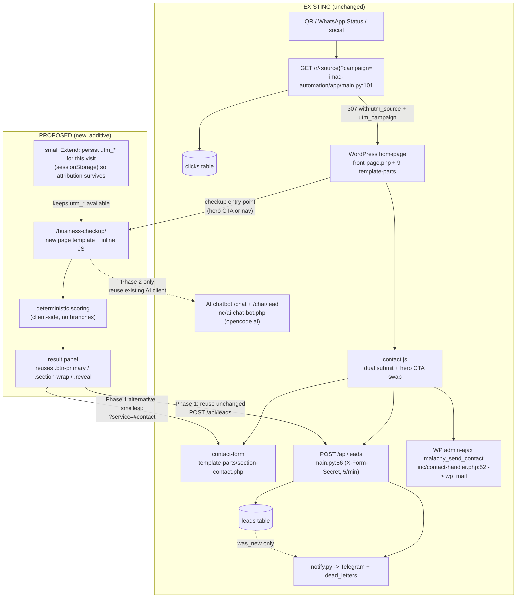

## 0. Scope, method and compliance

Investigation of how a "Business Checkup" could be added to the existing system with the
smallest practical change set. **Read-only**: no application file, schema, config, service or
deployment was modified. The only file created is this report.

Every claim below is labelled:

- **CONFIRMED** — read directly from the code in this repository.
- **LIKELY** — strong inference from the architecture; not directly executed.
- **UNKNOWN** — needs a decision, or needs runtime testing that this task deliberately did not do.

Discovery method: `git ls-files`, targeted reads of every file cited, `grep` sweeps for
analytics/GSAP/status-writers/nonce+honeypot names. No code was run against production.

---

## 1. Executive Summary

The system is **two cooperating applications, not a framework**:

1. A **classic WordPress PHP theme** (`malachy-portfolio`, v1.3.21) with hand-written CSS
   (2 566 lines), hand-written ES5 JS enqueued per-page, and **no build step, no bundler, no
   SPA router**. Routing is WordPress permalinks.
2. A **FastAPI service** (`imad-automation`) with five routes, raw `asyncpg` SQL (no ORM),
   four Postgres tables, Telegram notifications, and an in-process APScheduler job.

A Business Checkup **fits incrementally**. There is no architectural blocker:

- A dedicated page is already a solved pattern in this codebase — `template-lead-magnet.php`
  is a standalone page template with its own inline JS, honeypot and a CTA back into the
  contact form (`?service=<slug>#contact`). A checkup page is the same shape.
- Lead capture already accepts exactly the shape a checkup needs: `POST /api/leads` takes
  `name, contact, problem_text, source_campaign, idempotency_key`. It does not care how the
  visitor produced those values.
- The contact JS already has a **context-passing mechanism** (`?service=` → hidden field +
  visible context line, `contact.js:99-123`) that a checkup result can reuse verbatim.
- **No overhaul is required.** The boundaries — campaign tracking, contact form,
  notifications, lead API, database — can all stay exactly as they are.

Three findings change the shape of the recommendation:

1. **Attribution does not survive navigation.** UTM parameters are read from
   `window.location.search` only (`contact.js:112,197`); there is no cookie, no
   `sessionStorage`, no persistence. Today this works *only* because the campaign redirect
   lands on the homepage where the form also lives. A checkup on a separate URL must either
   carry the parameters in the link or gain a small persistence step. This is the single most
   important integration constraint.
2. **AI infrastructure already exists — twice, and inconsistently.** The theme has an
   OpenAI-compatible client (`https://opencode.ai/zen/v1/chat/completions`, model
   `deepseek-v4-flash-free`, `OPENCODE_API_KEY`, kept server-side in PHP) used by an existing
   AI chatbot; the FastAPI service has a *different* provider (Anthropic Messages API,
   `claude-sonnet-4-6`) used only for `POST /internal/draft`. An AI Business Report should
   reuse one of these rather than introducing a third.
3. **There are already three lead sinks and two Telegram senders.** Adding a fourth
   notification path would directly violate the brief's "no second notification system"
   constraint — the answer is to reuse, not add.

Recommended MVP: a new page template at `/business-checkup/`, 6–8 deterministic questions
scored client-side, a template-based result panel, and a submit that reuses
`POST /api/leads` **unchanged**. Zero schema change, zero new service, zero AI, zero new
dependency. The only genuinely optional architectural addition is a nullable
`diagnostic_data JSONB` column on `leads`, and only if answers must be re-renderable or
queryable (JSONB is already used for `dead_letters.payload`, so it is idiomatic here).

---

## 2. Existing Architecture

### 2.1 Frontend

| Aspect | Finding | Evidence |
|---|---|---|
| Type | Classic WordPress PHP theme, no framework | `malachy-portfolio/` |
| Name / version | "Malachy Portfolio" v1.3.21 | `style.css`; `functions.php:17` `MALACHY_THEME_VERSION` |
| Build system | **None for theme assets.** Root `package.json` exists for Playwright visual tests + `bin/` scripts only | `package.json`, `tests/visual/` |
| Entry points | `front-page.php`, `page.php`, `single.php`, `home.php`, `index.php`, `404.php`, `template-lead-magnet.php`, `template-thank-you.php` | `git ls-files malachy-portfolio` |
| Routing | WordPress permalinks. **Pretty permalinks confirmed in use** (`/blog` nav entry, `/thank-you/` redirect) | `template-parts/navigation.php:14`, `template-lead-magnet.php:107` |
| Page templates | Registered via `Template Name:` headers — 2 exist | `template-lead-magnet.php:3`, `template-thank-you.php:3` |
| Sections | 9 template-parts, numbered in the UI (`contact` is `09`) | `template-parts/section-contact.php:18` |
| CSS | Plain CSS, no preprocessor. `main.css` 2 566 lines, 55 `:root` custom properties; `ai-chat-bot.css` 679 lines | `assets/css/` |
| JS | Plain ES5 (`var`), IIFEs, `DOMContentLoaded`. No modules, no imports, no transpile | `assets/js/*.js` |
| Enqueueing | `wp_enqueue_scripts` → `malachy_enqueue_assets()`; version = `MALACHY_THEME_VERSION` as cache-buster | `functions.php:93-206` |
| Animation | GSAP 3.12.5 + ScrollTrigger + TextPlugin, **vendored locally**, `defer`, **desktop only** (`wp_is_mobile()` gate); per-section modules are **front-page only** (`is_front_page()`) | `functions.php:104-154`, `assets/js/vendor/` |
| Animation footprint | 10 modules + `AnimationManager.js`; **11 ScrollTrigger registrations** | `assets/js/animations/` |
| Contact JS | `contact.js` enqueued **on every page** with localised `malachyAjax {ajaxurl, nonce}` | `functions.php:180-196` |
| AI chatbot | `Malachy_AI_Chatbot`, REST namespace `malachy/v1`, enqueued **on all pages** | `inc/ai-chat-bot.php:16-92` |
| Analytics | **NONE.** No gtag/GTM/plausible/matomo/fbq/dataLayer/sendBeacon anywhere | grep sweep, zero hits |

### 2.2 Backend

`imad-automation` — FastAPI, containerised.

| Route | Auth | Rate limit | Purpose | Evidence |
|---|---|---|---|---|
| `GET /healthz` | none | — | `{"status":"ok","time":...}` | `main.py:80-83` |
| `POST /api/leads` | `X-Form-Secret` header | `5/minute` per IP (slowapi) | lead ingest | `main.py:86-98` |
| `GET /r/{source}?campaign=` | none | — | click log + redirect | `main.py:101-109` |
| `POST /internal/draft` | `X-Admin-Key` | — | AI content draft | `main.py:112-121` |
| `GET /internal/dead-letters` | `X-Admin-Key` | — | failed sends | `main.py:124-129` |

- **No ORM.** Thin `asyncpg` layer; pool `min_size=1, max_size=5`, `command_timeout=10`
  (`db.py:16-34`).
- **No service layer** — routes call `db.*` / `notify.*` / `ai.*` directly.
- **No auth framework** — two static shared secrets compared with `!=`
  (`main.py:70-77`). The form secret is documented as a cheap bot filter, not real auth
  (`config.py:31-35`); the real defences are the honeypot + rate limiter.
- CORS restricted to `IMAD_ALLOWED_ORIGINS`, default `https://imadconsulting.co.uk`
  (`config.py:45-49`) — a same-origin checkup is unaffected.
- Config fails loudly at boot for 5 required vars (`config.py:11-39`).
- Background job: APScheduler in-process, daily at `FOLLOWUP_CHECK_HOUR_UTC` (default 08:00)
  (`scheduler.py:29-38`).
- Logging: `httpx`/`httpcore` forced to WARNING specifically so the Telegram bot token in
  request URLs never reaches container logs (`main.py:34-40`).

### 2.3 Database

Postgres. One migration file, applied manually (`001_init.sql:2`). **No migration runner,
no versioning table** — CONFIRMED.

| Table | Key columns | Notes |
|---|---|---|
| `leads` | `id, name, contact, problem_text, source_campaign, status, idempotency_key UNIQUE, last_touch, reminded_at, created_at` | `status` default `'new'`; values documented in-line as `new / contacted / qualified / proposal / client / lost` |
| `clicks` | `id, source, campaign, ip, ua, ts` | campaign attribution store |
| `content_items` | `id, topic, pillar, draft_text, status, published_at, created_at` | AI draft store |
| `dead_letters` | `id, kind, payload JSONB, error, created_at, resolved_at` | **JSONB already in use** |

Indexes: `idx_leads_status`, `idx_clicks_campaign` (`001_init.sql:47-48`).
**`leads` has no JSON/JSONB column** — CONFIRMED.

### 2.4 Campaign system

```
GET /r/{source}?campaign=X
  → db.insert_click(source, campaign, client_ip, user-agent)     main.py:105-108
  → 307 RedirectResponse → https://imadconsulting.co.uk/?utm_source={source}&utm_campaign={campaign}
                                                                 main.py:109
```

Frontend side (`contact.js:197-213`): if `utm_source` is present, the hero primary button's
text becomes "Tell me your problem" and it scrolls to `#contact`; `utm_campaign` is copied
into the hidden `#source_campaign` input (`section-contact.php:66`).

**Attribution mechanism = URL parameters read once on page load. No persistence of any kind.**
CONFIRMED.

### 2.5 Lead system

Three distinct sinks already exist:

| Sink | Path | Destination | Evidence |
|---|---|---|---|
| A. Contact (WP) | `admin-ajax` action `malachy_send_contact` + REST `malachy/v1/contact` | `wp_mail()` to owner | `inc/contact-handler.php:16-18,127` |
| B. Chatbot lead (WP) | REST `malachy/v1/chat/lead` | `wp_mail()` **+ Telegram** | `inc/ai-chat-bot.php:134-162,380,432-442` |
| C. Lead API (FastAPI) | `POST /api/leads` | Postgres + Telegram + dead_letters | `main.py:86-98` |

The main contact form fires **A and C simultaneously** via `Promise.allSettled` and reports
success if *either* succeeded (`contact.js:149-168`) — by design ("lead only lost if BOTH
fail", `contact.js:149`).

Deduplication: the client sends one `idempotency_key` per **page load**
(`crypto.randomUUID()`, `contact.js:126-128`); the server returns the existing row and
**skips notification** if the key is already present (`db.py:47-52`, `main.py:96-97`).

### 2.6 Notification system

- Primary: **Telegram bot API**, `notify.py` only. Retries via tenacity (3 attempts,
  exponential backoff) and on final failure writes to `dead_letters` instead of losing the
  event (`notify.py:20-35`).
- Secondary: **WordPress `wp_mail()`** — the "email notification" in the brief. It lives in
  the theme, **not** in the FastAPI service. CONFIRMED.
- The theme independently posts to Telegram too (`ai-chat-bot.php:442`), i.e. **two Telegram
  senders** with separately configured bot/chat ids. UNKNOWN whether they are the same bot.

### 2.7 Deployment

- **WordPress**: InMotion shared host, behind Cloudflare. Production is updated by **Malachy's
  manual `git pull`** in `/home/imadco5/public_html/wp-content/themes/zubbyik_press_imad`
  (the git root sits *inside* the web root; the live theme is its `malachy-portfolio/`
  subdirectory). Static assets get `immutable, max-age=31536000`; HTML 300s
  (`.htaccess`). **PHP 7.0 is the compatibility floor** — the theme and ops tooling
  deliberately avoid arrow functions, spread, nullsafe and trailing commas
  (`docs/ops/project-reseed-preflight.php:22`, `HO-057:206`).
- **Backend**: Docker (`imad-automation/Dockerfile`), Netcup VPS, Traefik edge, CORS-locked;
  `/healthz` is the readiness probe.
- **Local/staging stack**: `docker-compose.yml` (wordpress:6.7-php8.2-apache + mysql:8.0 +
  imad-automation + traefik-public).

---

## 3. Current Funnel Trace (actual, not the brief's sketch)

```
QR / Status / social post
   │
   ▼
GET https://api.imadconsulting.co.uk/r/{source}?campaign={campaign}
   │  main.py:101-109
   ├─ db.insert_click(source, campaign, ip, ua)     → clicks table
   └─ 307 redirect → https://imadconsulting.co.uk/?utm_source={source}&utm_campaign={campaign}
        │
        ▼
   WordPress homepage  (front-page.php + 9 section template-parts)
        │
        ├─ contact.js:200-208  hero .btn-primary text → "Tell me your problem", scroll → #contact
        └─ contact.js:210-213  #source_campaign.value = utm_campaign
        │
        ▼
   <form id="contact-form">  (section-contact.php:42-72)
        │  nonce malachy_nonce · action=malachy_send_contact · honeypot `website`
        │  hidden malachy_service · hidden source_campaign
        ▼
   contact.js:130-191   Promise.allSettled([ ... ])      ← both fire independently
        ├────────────────────────────────────────────┐
        ▼                                            ▼
   POST https://api.imadconsulting.co.uk/api/leads   POST {ajaxurl} action=malachy_send_contact
        headers: X-Form-Secret                            (WP admin-ajax)
        body: name, contact, problem_text,                nonce + honeypot + 3/IP/hour transient
              website(honeypot), source_campaign,         (contact-handler.php:67-133)
              idempotency_key                             │
        │  main.py:88-98                                  ▼
        │  slowapi 5/min/IP                            wp_mail() → owner inbox
        │  honeypot → fake 200
        ▼
   db.insert_lead(...)  → leads table
        │  was_new?
        ▼
   notify.notify_new_lead() → Telegram @imadlead_bot
        │  on failure after 3 retries
        ▼
   dead_letters table  (never silently lost)
```

Also present, outside the main funnel: the **AI chatbot** (`/chat`, `/chat/lead`) which emails
the owner + pings Telegram on lead capture, and `POST /internal/draft` which writes
`content_items`.

---

## 4. Reusable Components (existing, do not rebuild)

| Need | Reuse | Where |
|---|---|---|
| A dedicated page route | WP page + `Template Name:` page template | `template-lead-magnet.php` (working precedent) |
| Page-scoped JS without a bundler | inline `<script>` in the template | `template-lead-magnet.php:84-155` |
| Lead ingestion | `POST /api/leads` — schema-agnostic about how values were produced | `main.py:86-98`, `models.py:4-9` |
| Notification (Telegram + email + dead-letter) | unchanged, already resilient | `notify.py`, `contact-handler.php:127` |
| Attribution carrier | hidden `source_campaign` + `utm_*` read | `section-contact.php:66`, `contact.js:197-213` |
| Passing context into the contact form | `?service=<slug>` → hidden field + visible line | `contact.js:99-123`, `section-contact.php:52` |
| WhatsApp handoff | `malachy_whatsapp` option + `wa.me` link | `section-hero.php:16,91` |
| Visual language | 55 CSS custom properties, `.btn-primary`, `.section-wrap`, `.reveal`, `.container-x` | `assets/css/main.css` |
| Modal/slide-out pattern | existing discovery panel (open/close, overlay, Esc, focus handling, scroll lock) | `contact.js:12-52` |
| AI call plumbing | OpenAI-compatible chat-completions client + server-side key | `ai-chat-bot.php:1306-1321` |
| Structured JSON storage precedent | JSONB column | `dead_letters.payload` |
| Conversion context for the chatbot | `malachy_chat_structured_context` transient | `inc/ai-chat-bot.php:896,1010` |
| Regression safety net | Playwright visual baselines, 15 routes tracked | `tests/visual/` |

---

## 5. Business Checkup Feasibility (five capabilities)

| Capability | Existing Infrastructure Reusable? | New Backend? | New DB? | New Frontend? | External Dependency? | Complexity |
|---|---|---|---|---|---|---|
| 1. Business Health Assessment | Yes — page template + inline JS + `/api/leads` + existing CSS | None for Phase 1 (score client-side). Optional: one route if scoring must be server-authoritative | None | One page template + one CSS block + one JS file | None | Question/branch model + report templating. Low–moderate, entirely additive |
| 2. Website Health Checker | Partially — page/UI/lead path reusable; the *checking* cannot be client-side (cross-origin fetch of the visitor's own site is blocked by CORS) | **Yes** — server-side fetch of a user-supplied URL, with allow-listing, timeouts, response-size caps | None (or JSONB column, see §8) | Yes (input + result UI) | None | SSRF surface, timeouts, caching, abuse as a scanning proxy. Moderate–high — the riskiest capability |
| 3. Email Deliverability Checker | Partially — UI/lead path reusable; DNS lookups must be server-side | **Yes** — SPF/DKIM/DMARC/MX lookups. Either a FastAPI route (+`dnspython`) or a WP REST route using `dns_get_record` (PHP 7.0 has it, but shared-host DNS resolution is unverified) | None (or JSONB column) | Yes (domain input + findings UI) | DNS resolvers (public infrastructure, no key/fee) | DNS timeouts, upstream rate limits, result caching, comparable SSRF/abuse considerations. Moderate |
| 4. WhatsApp Readiness Assessment | **Yes** — pure questionnaire; `wa.me` link + `malachy_whatsapp` option already exist | None | None | Yes (question UI only) | None | Lowest of the five. Deterministic, no network calls |
| 5. AI Business Report Generator | **Yes, two options exist** — theme OpenAI-compatible client (`opencode.ai/zen/v1/chat/completions`, server-side `OPENCODE_API_KEY`) or FastAPI Anthropic client (`claude-sonnet-4-6`) | Small (a route that takes structured answers + returns narrative) | None (cache in transients or `content_items`) | Result panel addition only | One existing AI provider (already paid for/configured) | Prompt/report contract, latency per report, cost per report, failure handling, keeping keys server-side. Defer to Phase 2 |

Note on capability 5's inconsistency: the system currently talks to **two different AI
providers** for two features. Picking one for reports is a decision, not merely a code task
(see §13).

---

## 6. Recommended MVP

Smallest version that is genuinely useful and changes almost nothing:

```
/business-checkup/  (new WP page + new page template, precedent: template-lead-magnet.php)
   ↓
6–8 deterministic questions (Business + WhatsApp readiness only) — client-side, no branches
   ↓
Deterministic scoring (explicit thresholds in one JS object)
   ↓
Template-based result: score band + 3–5 concrete findings + recommended next step
   ↓
REUSE the existing contact form submission path unchanged:
   POST /api/leads   (name, contact, problem_text, source_campaign, idempotency_key)
   problem_text = visitor's own text + a compact appended checkup summary (≤ 4 000 chars)
   ↓
Existing Telegram + wp_mail + dead_letters behaviour, untouched
```

Deliberately **out** of the MVP: Website Checker (SSRF surface), Email Deliverability
(needs server-side DNS work), AI narrative, analytics events, any schema change.

Justification: every element above has a working precedent in this repository
(`template-lead-magnet.php` for the page, `contact.js` for submit/honeypot/status handling,
`/api/leads` for ingest). The MVP introduces **no new service, no new dependency, no schema
change, and no new notification path**.

If a smaller MVP is wanted still: ship the checkup as a **result calculator with a CTA back
into the existing contact form** (`/?service=<slug>#contact` — the pattern already used by the
lead-magnet tripwire, `template-lead-magnet.php:77`). Then not even a submit path is new: the
checkup merely pre-fills the existing form. This is the absolute minimum change set and it
still captures the lead and the attribution.

---

## 7. Integration Architecture



Solid arrows = existing flow. Dotted arrows = proposed, additive.

---

## 8. Change-Surface Map (real paths)

| Area | Existing file / module | Proposed change | Risk | Can avoid change? |
|---|---|---|---|---|
| Route | WordPress pages (no file) | Create a `business-checkup` page; permalink `/business-checkup/` | Low. Pretty permalinks already in use | No — a URL must exist somewhere. A homepage section would avoid a new URL but see §11 |
| Page template | new `malachy-portfolio/template-business-checkup.php` | **New file**, modelled on `template-lead-magnet.php` | Low. New files don't alter existing behaviour | No, unless the checkup is embedded in the homepage (Option C) |
| Checkup JS | new `malachy-portfolio/assets/js/business-checkup.js` (or inline, as lead-magnet does) | **New file** + one enqueue line | Low. Must be enqueued only on the checkup page to protect homepage payload | Yes — inline `<script>` in the template, exactly as `template-lead-magnet.php:84-155` |
| Enqueue | `malachy-portfolio/functions.php:95-206` | **Extend** (additive `wp_enqueue_script` guarded by a page check) | Low but non-zero: this function is shared by every page | Yes — inline `<script>` avoids touching `functions.php` entirely |
| CSS | `malachy-portfolio/assets/css/main.css` (2 566 lines) | **Extend** with a bounded, prefixed block (`.checkup-*`), reusing existing custom properties | Low. Risk is specificity collisions; prefixing avoids it | Yes — a separate small stylesheet enqueued on that page only |
| Hero CTA | `malachy-portfolio/template-parts/section-hero.php:40-42` | **Prefer none.** If the checkup needs a homepage entry point, add a *second* link rather than altering the existing button | Medium — the hero CTA is already conditionally rewritten by `contact.js:200-208`; two writers on the same element is a conflict class this project has been burned by | Yes — enter from nav, from a new section, or from the offers/tripwire pattern |
| Navigation | `malachy-portfolio/template-parts/navigation.php:11-14` | **Extend**: one array entry (`'href' => '/business-checkup/'`, `'route' => true`) | Low. Pattern already supports non-anchor routes (`/blog`) | Yes — reachable via CTA links without a nav item |
| Attribution | `malachy-portfolio/assets/js/contact.js:112,197-213` | **Extend** (small): persist `utm_source`/`utm_campaign` for the visit so they survive navigation | Medium — this file is shared by every page and the hero CTA. The project's documented recurring failure is shared code validated against one caller only | Yes for Phase 1 — carry the params in the checkup URL and post them back; no change to `contact.js` |
| Lead submit | `imad-automation/app/main.py:86-98`, `models.py:4-9` | **Reuse unchanged** | Low | n/a — no change proposed |
| Database | `imad-automation/migrations/001_init.sql` | **Optional only**: `002_leads_diagnostic_data.sql` adding `diagnostic_data JSONB NULL` + one `INTEGER`-free additive `ALTER TABLE`; extend `insert_lead` (`db.py:39-61`) with one parameter | Medium. Additive nullable column is backward-compatible; the repo has **no migration runner**, so it is a manual `psql` step on the VPS | Yes — Phase 1 stores a compact summary inside `problem_text` (TEXT, capped at 4 000 chars by `models.py:7`) |
| Campaign tracking | `imad-automation/app/main.py:101-109` | **None** | — | Yes, entirely |
| Notifications | `imad-automation/app/notify.py`, `inc/contact-handler.php:127`, `inc/ai-chat-bot.php:380,432` | **None** | — | Yes, entirely |
| AI | `inc/ai-chat-bot.php:1306-1321` (OpenAI-compatible) or `app/ai.py:31-53` (Anthropic) | **Reuse one** in Phase 2 — no new client | Low, but provider choice must be decided | Yes — Phase 1 has no AI |
| Analytics | none exists | **New** mechanism if wanted (defer). Cheapest: a small FastAPI route writing to a new events sink, or extend `clicks` (`001_init.sql:17-24`) | Low–moderate | Yes — defer entirely |
| Tests | `tests/visual/` (15 tracked routes) | **Extend**: add a route + baseline for the checkup page | Low. New page = new baseline; existing baselines unaffected *provided the homepage is not modified* | Yes, if the homepage is left alone |
| `.htaccess` / exposure | `.htaccess` (repo root) | Unrelated open item (HO-058): the repo checkout is web-reachable. Do **not** store checkup answers in files | — | n/a — but it constrains where data may live |

---

## 9. Risks (concrete, with mitigations)

| # | Risk | Evidence | Mitigation |
|---|---|---|---|
| R1 | **Attribution lost** the moment the visitor navigates to the checkup — the single biggest constraint | `contact.js:112,197`; no storage anywhere in the theme | Carry `utm_*` in the checkup link; post them back on submit; or add sessionStorage persistence (one small, reviewed Extend) |
| R2 | **Idempotency key is per page load**, and duplicates **skip the notification** | `contact.js:126-128`; `db.py:47-52`; `main.py:96-97` | If a checkup submit and a contact submit both fire on one page load, they share the key and the second is silently deduped. Give the checkup its own key per submission, or submit once |
| R3 | `problem_text` is capped at **4 000 chars** | `models.py:7` | Compact the summary (recommended: a short, human-readable block, not a full answer dump) |
| R4 | **Three lead sinks, two Telegram senders already** | `main.py:97`, `contact-handler.php:127`, `ai-chat-bot.php:380,432-442` | Add no fourth. Reuse `POST /api/leads` |
| R5 | Rate limits could bite one visitor twice: FastAPI **5/min/IP** and WP **3/hour/IP** | `main.py:87`, `contact-handler.php:85-92` | If the checkup posts to `/api/leads` *and* the visitor then uses the contact form, the WP transient may reject the second send. Prefer the "pre-fill the existing form" MVP variant, or accept the FastAPI path only |
| R6 | The Website Checker is an **SSRF / scanning-proxy surface** if it fetches arbitrary URLs | not yet written | Allow-list schemes/hosts, block RFC1918 + metadata IPs, cap redirects/size/time. Or defer the capability |
| R7 | **PHP 7.0 constraint** on production | `docs/ops/project-reseed-preflight.php:22`, `HO-057:206` | No arrow functions, no spread, no nullsafe, no trailing commas in calls |
| R8 | **GSAP/ScrollTrigger conflicts** on the homepage (11 registrations, front-page-only modules) | `functions.php:104-154`; `assets/js/animations/` | Prefer a standalone page (Option A) over an embedded homepage section (Option C) — and do not modify the hero |
| R9 | **Visual-regression churn**: 15 tracked routes with baselines | `tests/visual/visual-baseline/` | Keep the homepage markup untouched; add the checkup as a new route + new baseline |
| R10 | Honeypot/nonce **name parity** is this project's documented recurring failure (`website` vs `malachy_hp`; `malachy_nonce` vs `discovery_nonce`) | `contact-handler.php:68-83` comments; `contact.js:141`; `template-lead-magnet.php:55` | A checkup form must use `website` if it posts to `/api/leads` (schema match), and whichever nonce name its WP handler verifies. Check **every** caller, not one |
| R11 | **Deployment is manual + cached**: manual `git pull`, Cloudflare + 300s HTML cache, `immutable` static assets | `HO-054 C6`; `.htaccess` | New page needs a cache purge after deploy; assets versioned by `MALACHY_THEME_VERSION` |
| R12 | The repo checkout is **inside the web root and currently web-readable** (open item) | `HO-058` (live 200s on `docker-compose.yml`, `docs/`) | Never store checkup answers or reports as files under the checkout. This report's storage recommendations are DB-side for that reason |
| R13 | `/chat/lead` is registered with `permission_callback => '__return_true'` and no nonce (unlike the contact path) | `ai-chat-bot.php:134-140` vs `contact-handler.php:33-36` | Not caused by the checkup, but do not reuse that endpoint as a lead sink; if anything, it is a pre-existing spam surface to review separately |
| R14 | **No analytics exist at all**, so "checkup_started → report_viewed" has no foundation | grep sweep, zero hits | Decide analytics separately (Phase 6). Cloudflare-side analytics may exist but that is outside the repo — UNKNOWN |

---

## 10. What Should NOT Be Changed

| Component | Why |
|---|---|
| `GET /r/{source}` redirect + its `utm_source`/`utm_campaign` contract (`main.py:101-109`) | Every QR code and social link depends on it; attribution breaks site-wide if the URL shape changes |
| `contact.js` dual-submit contract (`Promise.allSettled`, success if either path succeeds, `contact.js:149-168`) | It is the redundancy guarantee ("lead only lost if BOTH fail") |
| `inc/contact-handler.php` nonce/honeypot/rate-limit logic (`:74-92`) | Both field-name variants must keep working including cached markup |
| `template-parts/section-hero.php` hero markup + the CTA swap (`contact.js:200-208`) | The brief explicitly says do not modify the hero; also two writers on one element is the known failure class |
| `imad-automation/app/notify.py` Telegram + `dead_letters` semantics | Already resilient by design; adding a parallel sender duplicates it |
| The WordPress `wp_mail()` fallback (`contact-handler.php:127`) | Second independent delivery path; the brief calls it out |
| The `leads` schema (unless a migration is consciously approved) | Backward compatibility; three existing writers depend on the current shape |
| The homepage's 9 section template-parts and the GSAP pipeline | Visual baselines + animation conflicts; no need to touch them |
| `crypto.randomUUID()` idempotency approach for the existing form | It is what prevents double-submit duplicates today |

---

## 11. Frontend Integration Options — technical assessment

| Option | Fit | Technical implications |
|---|---|---|
| **A. Dedicated page `/business-checkup/`** | **Best.** Direct precedent exists | New route + new page template + page-scoped JS/CSS. No bundler needed. Front-page-only GSAP modules never load here, so **zero animation conflict**. `contact.js` is already global if the existing form is reused. Mobile behaviour inherits the theme. Accessibility follows the existing markup conventions. Payload stays off the homepage. Total: additive files, one optional nav entry |
| B. Modal/drawer on the homepage | Viable but weaker | The discovery panel already proves the pattern (`contact.js:22-52`): overlay, Esc, focus move, scroll lock. But a 6–8 question flow inside a drawer is a state machine on the homepage, competing with 11 ScrollTrigger registrations and the hero timeline. Also inflates the homepage bundle for every visitor |
| C. Embedded homepage section | **Not recommended** | Adds a 10th section, forces ScrollTrigger work inside `AnimationManager` territory, changes homepage markup (breaking visual baselines), and puts the funnel entry point below a scroll animation. The brief's own "site is already dense" concern applies |
| D. Hybrid: dedicated page + homepage entry point | **Recommended shape** | Page as in A, plus a *new* secondary link (not a rewrite of the hero button) and/or a nav entry. Keeps the hero untouched |

---

## 12. Design-system reuse

Fonts/typography/colours/spacing/shadows/borders/breakpoints all live in the 55 custom
properties at the top of `main.css`; buttons are `.btn-primary` / `.btn-secondary`; layout
helpers are `.section-wrap`, `.container-x`; entrance animation is the `.reveal` class;
section headers use `.section-label` with an index number. **A checkup needs no new visual
system** — reuse these class names and the existing tokens, and add only checkup-specific
rules under a `.checkup-*` prefix.

---

## 13. Open Questions (must be decided before implementation)

1. **Attribution persistence**: carry `utm_*` in the checkup link (no code change to shared
   JS) or add sessionStorage persistence to `contact.js` (shared-file Extend, needs review)?
2. **Lead path for the checkup result**: post directly to `POST /api/leads` (Telegram, no
   email) or route the visitor into the existing contact form via
   `/?service=<slug>#contact` (both email + Telegram, but relies on the visitor completing a
   second form)?
3. **Store answers as JSONB or as compact text?** Only needed if reports must be re-rendered,
   compared over time, or fed to AI. Otherwise text in `problem_text` is enough.
4. **Which AI provider** for Phase 2 — the theme's existing OpenAI-compatible client
   (`opencode.ai/zen`, `deepseek-v4-flash-free`) or the backend's Anthropic client
   (`claude-sonnet-4-6`)? Today both are live for different features.
5. **Scope of Phase 1**: Business + WhatsApp readiness only, or include the Email
   Deliverability checker (server-side DNS) from the start?
6. **Where does the visitor enter the checkup** — nav entry, a new secondary hero link, the
   offers cards, or the lead-magnet tripwire pattern?
7. **Analytics**: none exists. Add nothing (rely on `clicks` + lead rows), or introduce a
   minimal event path in a later phase?
8. **Slug and public name** — `/business-checkup/`? ("Checkup" may read as medical; the
   brand voice elsewhere is plain-spoken.)
9. Do the two Telegram senders use the same bot/chat? Affects notification noise, not the
   checkup itself.

---

## 14. Proposed Implementation Sequence (future work; nothing implemented here)

```
Phase 0 — this investigation (done)
    ↓
Phase 1 — minimum viable checkup, standalone page
          • new page template + WP page (precedent: template-lead-magnet.php)
          • 6–8 deterministic questions, client-side scoring, template result
          • submit via EXISTING POST /api/leads, or pre-fill the existing contact form
          • carry utm_* through the URL; no change to shared JS
          • acceptance: a lead row with source_campaign populated + a Telegram notification,
            and every existing funnel behaviour byte-identical
    ↓
Phase 2 — attribution hardening (only if Phase 1 shows leakage)
          • small reviewed Extend to contact.js (sessionStorage) OR keep URL-carrying
    ↓
Phase 3 — storage upgrade (only if reports must be re-rendered/queried)
          • 002 migration: leads.diagnostic_data JSONB + insert_lead parameter
    ↓
Phase 4 — server-side checkers
          • Website Health (SSRF-guarded) and/or Email Deliverability (DNS) as NEW FastAPI
            routes; reuse the existing lead + notification path for results
    ↓
Phase 5 — AI report narrative
          • reuse ONE existing AI client; keep keys server-side; template fallback when AI fails
    ↓
Phase 6 — analytics events (optional, needs a mechanism that does not exist today)
    ↓
Phase 7 — homepage integration (only if data justifies it; nav/CTA entry first)
```

Each phase is independently deployable and independently revertible. Phases 1–2 touch no
shared backend code and no shared frontend file (if the "pre-fill the existing form" variant
is chosen, Phase 1 touches *nothing* existing at all).

---

## 15. Complexity / Effort Drivers

| Driver | Why it drives complexity |
|---|---|
| Attribution persistence | The only change that touches shared, multi-caller frontend code — this project's documented repeated failure mode |
| Question branching | Branching turns a static form into a state machine: back/forward, partial completion, and validation per branch |
| Server-side fetching (Website Checker) | SSRF allow-listing, timeouts, size caps, and being used as a scanning proxy |
| DNS lookups (Email Checker) | Timeouts, upstream limits, caching, shared-host resolver behaviour on PHP 7.0 |
| Schema change | No migration runner exists — it is a manual `psql` step per environment; must be additive + nullable |
| Report generation | Prompt/output contract, determinism, latency, per-report cost, failure mode |
| AI integration | Provider choice (two exist), key handling, retries, cost, and graceful degradation |
| Analytics | No mechanism exists at all — any option is net-new infrastructure |
| Frontend state | Avoiding it: keep scoring client-side and stateless; store nothing between page loads unless required |
| Rate-limit interaction | Two independent limiters (5/min API, 3/hour WP) that a checkup-plus-contact flow could trip |
| Idempotency semantics | Deduped submissions silently skip notification — any second submit path must mint its own key |
| Cache/deploy | Manual pull, Cloudflare, `immutable` assets, `MALACHY_THEME_VERSION` cache-busting |

---

## 16. Production-Safety Assessment (brief §25)

| Question | Answer | Why |
|---|---|---|
| Add the checkup without changing existing contact behaviour? | **Yes** | New page + new files; the contact form, its JS and its handler are untouched. The "pre-fill the existing form" variant literally adds no executable change to existing code |
| Keep current campaign URLs working? | **Yes** | `/r/{source}` is not modified |
| Keep existing UTM attribution? | **Yes** | Not modified. Caveat: attribution *to the checkup* needs the params carried (R1) |
| Keep the existing contact form? | **Yes** | Unchanged |
| Keep the WordPress fallback? | **Yes** | `contact-handler.php` unchanged |
| Keep existing Telegram/email notifications? | **Yes** | `notify.py`, `wp_mail` paths unchanged; nothing added |
| Deploy the checkup independently? | **Yes** | Theme-only change; ships with the normal manual pull. Backend untouched in Phase 1 |
| Roll back without affecting the current funnel? | **Yes** | Delete the page + template, or revert the theme commit; no shared code path depends on it |

**Verdict: incremental, not an overhaul.**

---

## 17. Necessary vs Nice-to-have architectural work

**Necessary (only if the corresponding capability is wanted):**

- Server-side route(s) for URL/DNS checking (capabilities 2 and 3) — cannot be done in the
  browser.
- A place to store structured answers **if** reports must be re-rendered or queried — one
  nullable JSONB column + one manual migration.

**Nice-to-have (explicitly out of scope; do not let this creep):**

- Refactoring the three lead sinks / two Telegram senders into one. Real duplication, but
  unifying it risks the live funnel — the brief's own constraint says preserve it.
- Fixing `leads.status` never being written (so the daily follow-up job cannot fire). A real
  bug, worth its own handover, unrelated to the checkup.
- Adding a migration runner.
- Moving the repo checkout out of the web root (HO-058) — infra hygiene, not checkup work.
- Consolidated analytics.

---

## 18. Evidence index (file:line for the load-bearing claims)

```
imad-automation/app/main.py:86-98      POST /api/leads: honeypot->fake 200, insert, notify if new
imad-automation/app/main.py:101-109    GET /r/{source} click log + 307 with utm params
imad-automation/app/main.py:70-77      static shared-secret auth (form secret / admin key)
imad-automation/app/db.py:39-61        insert_lead + idempotency -> (id, was_new)
imad-automation/app/db.py:64-75        get_stale_leads filters status='contacted'
imad-automation/app/models.py:4-9      LeadIn: problem_text max_length=4000; website honeypot
imad-automation/app/notify.py:20-45    Telegram retries -> dead_letters; notify_new_lead
imad-automation/app/scheduler.py:19-38 daily stale-lead check
imad-automation/app/ai.py:31-53        Anthropic claude-sonnet-4-6 (draft generation only)
imad-automation/migrations/001_init.sql:4-48  4 tables; leads has no JSON column; dead_letters.payload JSONB
malachy-portfolio/assets/js/contact.js:149-168 dual submit via Promise.allSettled
malachy-portfolio/assets/js/contact.js:197-213 utm read + hero CTA swap + #source_campaign
malachy-portfolio/assets/js/contact.js:126-128 idempotency key = per page load
malachy-portfolio/assets/js/contact.js:99-123  ?service= pre-fill (context-passing precedent)
malachy-portfolio/assets/js/contact.js:12-52   discovery panel modal pattern
malachy-portfolio/inc/contact-handler.php:74-92 nonce + both honeypot names + 3/IP/hour
malachy-portfolio/inc/contact-handler.php:127  wp_mail -> owner (the "email notification")
malachy-portfolio/inc/ai-chat-bot.php:80-88    REST urls + nonce + model exposed to JS
malachy-portfolio/inc/ai-chat-bot.php:134-162  /chat/lead: __return_true, no nonce
malachy-portfolio/inc/ai-chat-bot.php:380,432-442 wp_mail + DIRECT Telegram send
malachy-portfolio/inc/ai-chat-bot.php:1306-1321 opencode.ai OpenAI-compatible client, Bearer key
malachy-portfolio/functions.php:17, 93-206     version constant + enqueue map (front-page gates)
malachy-portfolio/template-lead-magnet.php:3,48-155 page-template + inline-JS precedent
malachy-portfolio/template-parts/section-contact.php:42-72 form fields, nonce, honeypots
malachy-portfolio/template-parts/section-hero.php:16,40-42,91 hero CTA + wa.me link
malachy-portfolio/template-parts/navigation.php:11-14 nav array (section vs route)
docs/ops/project-reseed-preflight.php:22        PHP 7.0 compatibility floor
tests/visual/visual-baseline/routes.json        15 tracked visual routes
```

**Grep sweeps that returned zero hits** (i.e. absence is evidence): analytics
(`gtag|googletagmanager|analytics|plausible|matomo|fbq|dataLayer|sendBeacon`), any writer of
`leads.status` (`UPDATE leads SET status`), any existing quiz/checkup/assessment module.
