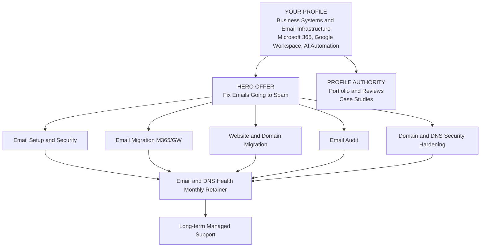

You are working inside an existing Obsidian vault at:

    /home/zubbyik/tikeazubby__research

# HARD SAFETY RULES — read before doing anything

1. This vault already exists and contains real content. You are ONLY permitted to CREATE new files. You must NEVER overwrite, truncate, delete, move, or rename any existing file or folder in this vault.
2. Before writing anything, run a check for each target path below. If a file already exists at that exact path, DO NOT touch it — instead create the file with a `-v2` suffix (e.g. `IMaD-Consulting-Offers-Strategy-v2.md`), and print a message telling the user a collision was detected and where the new file was written instead.
3. The only existing file you may modify is `30-MOCs/MOC-Freelance.md`, and only by appending one new line at the very end of the file (a link to the new note). You must never rewrite, reorder, or delete any of that file's existing content. If a link to this note already exists in that file, skip the append entirely — do not add a duplicate.
4. Do not touch `.git/`, `.obsidian/`, or any file outside the two paths below.
5. If anything is ambiguous or a safety rule can't be satisfied (e.g. you can't tell if a line already exists), stop and report back instead of guessing.

# Task

Create ONE new file at:

    40-Projects/IMaD-Consulting-Offers-Strategy.md

Before writing it, check whether `70-Resources/Templates/TEMPLATE-Strategy-Note.md` or `70-Resources/Templates/TEMPLATE-Project.md` exists. If either does, read it (read-only) and use its frontmatter structure/fields for the new note. If neither exists, use this fallback frontmatter:

```yaml
---
title: IMaD Consulting — PeoplePerHour Offers Strategy
type: strategy-note
tags: [freelance, imad-consulting, peopleperhour, offers, pricing]
created: {{today's date, YYYY-MM-DD}}
status: active
related: "[[MOC-Freelance]]"
---
```

Then insert the body content exactly as given between `--- BODY START ---` and `--- BODY END ---` below (do not summarize, shorten, or rewrite it — this is the final, agreed output of a brainstorming session and must be preserved verbatim). You may adjust only the outer frontmatter to match the vault's template conventions; the body markdown itself should be inserted as-is.

After the file is created, append exactly one line to the end of `30-MOCs/MOC-Freelance.md`:

    - [[IMaD-Consulting-Offers-Strategy]] — PeoplePerHour hub-and-spoke offer strategy, pricing (launch vs. target), and WordPress chatbot-readiness funnel

Skip this step if a line containing `IMaD-Consulting-Offers-Strategy` already exists anywhere in that file.

Report back with: the exact path of the file you created (including whether a `-v2` collision suffix was used), and whether the MOC-Freelance.md append happened or was skipped.

--- BODY START ---

# IMaD Consulting — PeoplePerHour Offers Strategy

I like the hub-and-spoke strategy. Below is the original structure, plus additional input layered in as two new offers, one retainer conversion, a tiering suggestion, and a few sequencing notes — same format throughout.

## Note: this is a first post on PeoplePerHour — repricing for zero reviews

Every price below shows two numbers: **Launch** (what to list at with no reviews, no portfolio proof, no track record on the platform) and **Target** (what to move toward once there are ~10 reviews and completed work to point to). A stranger evaluating an unproven seller is pricing in risk, not just cost — the launch prices exist to remove that friction, not to represent what the work is worth long-term.

**How to move from Launch to Target:**

| Reviews | Pricing |
|---------|---------|
| 0–3 | Launch price |
| 4–9 | Launch price + 25–40% |
| 10+ | Target price |

Raise the price on new orders only, never mid-project. Do it order-by-order as reviews come in, not on a fixed calendar — a bad week for demand isn't a reason to hold launch pricing longer than needed.

## Funnel diagram



Two changes from the original diagram: **Offer 6** sits as a spoke (not a future item) because it's a natural companion to the hero offer at point of sale, and **the retainer is promoted from a bullet point to an actual offer**, since "long-term managed support" only becomes real revenue if it's something a buyer can click "order" on.

---

## Offer 1 (Hero)

### I can

**fix your business emails going to spam with SPF, DKIM, DMARC & DNS**

**Starting Price:** Launch: £30 → Target: £85
**Delivery:** 2 Days
**Category:** Technology & Programming
**Tags:** Email Deliverability, SPF, DKIM, DMARC, DNS

**Description:** Businesses lose customers when important emails land in spam or fail to deliver. Perform a complete email deliverability audit, identify authentication and DNS issues, configure SPF, DKIM and DMARC, investigate blacklist or reputation problems, and optimize email infrastructure for reliable inbox placement. Ideal for Microsoft 365, Google Workspace, Zoho, SendGrid, Mailchimp, Klaviyo, and other business email platforms.

**Add-ons:** Google Postmaster Setup — £25 · Deliverability Report — £20 · DMARC Monitoring — £35

**Tier this one:** This is the offer that will carry the most search volume, so it's worth turning into three packages instead of one flat price — platforms that support tiered packages (Basic/Standard/Premium) tend to reward listings that use all three tiers with better placement, and it lifts average order value without changing scope of the base fix.

| Tier | Launch Price | Target Price | Scope |
|------|-------------|--------------|-------|
| Basic | £30 | £85 | SPF/DKIM/DMARC audit + fix, single domain |
| Standard | £55 | £140 | + Google Postmaster setup + blacklist remediation |
| Premium | £80 | £195 | + DMARC monitoring (1 month) + deliverability report |

Note the gap between launch and target isn't uniform — Basic drops the most in relative terms (£30 vs £85) because that's the tier doing the "convince a stranger to click order" work. Standard and Premium can stay closer to their eventual price since a buyer choosing those tiers is already past the initial trust hurdle.

---

## Offer 2

### I can

**set up secure business email with Microsoft 365 or Google Workspace**

**Starting Price:** Launch: £45 → Target: £95
**Delivery:** 2 Days
**Tags:** Microsoft 365, Google Workspace, Business Email, DNS, Email Setup

**Description:** Configure business email from scratch, verify the domain, configure DNS records, implement SPF, DKIM and DMARC, create user accounts, configure mailboxes, and test email delivery. Result: a secure, professionally configured email environment ready for daily operations.

**Upsells:** Additional users, Shared mailboxes, Email signatures

---

## Offer 3

### I can

**migrate your business email to Microsoft 365 or Google Workspace**

**Starting Price:** Launch: £110 → Target: £175
**Delivery:** 3 Days
**Tags:** Email Migration, Microsoft 365, Google Workspace, IMAP, DNS

**Description:** Migrate mailboxes, folders, contacts, calendars, DNS records, and authentication with minimal disruption while preserving business data and validating everything before completion — from Microsoft 365, Google Workspace, IMAP, or cPanel.

**Upsells:** Large mailbox migration, Additional mailboxes, Weekend migration

**Smaller discount here on purpose:** This offer sits deeper in the funnel — most buyers reach it after Offer 1 or 2, or after seeing a review. Discount it less aggressively (roughly 35% off target vs. Basic's 65% off) since the trust-building work is largely already done by the time someone's here.

---

## Offer 4

### I can

**transfer your website, domain and business email with minimal downtime**

**Starting Price:** Launch: £175 → Target: £250
**Delivery:** 5 Days
**Tags:** Website Migration, Domain Transfer, Hosting, DNS, Google Workspace

**Description:** Safely migrate the website, transfer the domain, move business email, update DNS records, configure SSL, verify email routing, and perform post-migration testing. Goal: a seamless transition with the business remaining online and operational.

**Upsells:** Website optimisation, SSL setup, Backup & rollback plan

---

## Offer 5

### I can

**audit and report on your business email security and deliverability**

**Starting Price:** Launch: £15 → Target: £60
**Delivery:** 1 Day
**Tags:** Email Audit, Deliverability, SPF, DKIM, DMARC

**Description:** Review email infrastructure for authentication, DNS, sender reputation, routing, and configuration issues. Deliver a detailed report outlining problems, risks, and prioritized recommendations to improve security and inbox placement before they affect the business.

**Upsells:** Implement all recommendations, DNS cleanup, Monthly monitoring

**This is the actual loss-leader at launch:** At £15, this stops being "a cheaper alternative to Offer 1" and becomes a near-zero-risk way for a stranger to find out whether the work is any good, before reading a single review. The cost is an hour of diagnostic work, and the real payoff isn't the £15 — it's the review and the upsell into Offer 1 or 2 that follows. Once past ~10 reviews, retire this pricing and let Offer 1 Basic reabsorb the "cheap entry point" role.

**Watch this one for cannibalization:** Offer 5 and Offer 1 both promise "fix the spam problem" territory to a buyer scanning search results — the difference (audit-only vs. audit-and-fix) may not be obvious from a thumbnail and title alone. Titling this one explicitly diagnostic-only ("audit and report" rather than "audit and optimize") lets buyers self-select the right offer instead of messaging to ask which one they need.

---

## Offer 6 (New)

### I can

**lock down your domain and DNS against spoofing, hijacking and email fraud**

**Starting Price:** Launch: £35 → Target: £70
**Delivery:** 1 Day
**Tags:** Domain Security, DNS, DMARC, Registrar Lock, Email Fraud Prevention

**Description:** Harden the domain against the two most common attack vectors business owners overlook: DNS hijacking and email spoofing used for invoice fraud. Includes registrar-lock verification, DNS registrar account security review, DMARC policy enforcement (moving from monitor-only to reject where safe), and a check for typosquat/lookalike domains actively targeting the brand.

**Add-ons:** Typosquat domain monitoring (quarterly) — £30 · WHOIS privacy audit — £15 · Registrar 2FA/security hardening — £20

**Why this one:** It sits next to the hero offer at the moment of highest buyer anxiety — someone who just found out their emails go to spam is already primed to worry about "wait, can someone spoof my domain too?" It's a natural same-cart add or same-week repeat booking, and it's a distinct enough keyword set (domain security, spoofing, fraud) to rank independently rather than competing with Offers 1 and 5 for the same search terms.

---

## Offer 7 (New — Retainer)

### I can

**provide ongoing email & DNS health monitoring for your business**

**Starting Price:** Launch: £20/month → Target: £40/month
**Delivery:** Recurring — monthly
**Tags:** Managed Email, DMARC Monitoring, DNS Monitoring, Retainer, Business Continuity

**Description:** Email infrastructure silently degrades — certificates expire, DMARC reports flag new abuse, a marketing tool gets added without updating SPF and quietly breaks deliverability. Monitor DNS, DMARC aggregate reports, blacklist status, and SSL expiry monthly, and flag issues before they cause missed invoices or client emails. Includes a quarterly deliverability report and one included fix per quarter.

**Add-ons:** Additional domains — £15/domain/month · Priority response (24hr) — £15/month · Quarterly on-call automation review (n8n workflows) — £25/month

**Why this one:** Every other offer in this list is one-off. A retainer is what actually compounds — it converts a single £85 job into recurring revenue, and it's the offer most likely to be accepted by someone who already trusts the seller from Offer 1, 2, 3, or 6. It also gives a legitimate, low-friction reason to check in monthly, which is where upsell conversations about automation and AI chatbots happen naturally rather than as a cold pitch.

**Grandfather early retainer clients:** Unlike the one-off offers, don't move existing retainer subscribers up to target price as reviews grow — raise the listed price for new subscribers only, and let early clients keep their launch rate. A £20/month client who's been on board since the first review is a stronger asset than the extra £20/month, and grandfathering is a well-understood, non-awkward norm for recurring services.

---

## Offer 8 (New)

### I can

**assess whether a WordPress site can actually support a chatbot — before paying to build one**

**Starting Price:** Launch: £30 → Target: £65
**Delivery:** 2 Days
**Tags:** WordPress, Chatbot Readiness, Site Audit, Tech Stack Assessment, Migration Planning

**Description:** A lot of chatbot requests on WordPress hit the same wall: shared hosting with no room for a persistent process, a theme/plugin stack that can't cleanly host a modern JS widget, or a stack that could technically embed a chatbot but only via an external API call that adds noticeable UX lag. Review the hosting plan, theme/plugin architecture, resource limits, and traffic pattern, and report honestly which of three paths applies: a lightweight embed will work as-is, a partial decouple (keep WordPress, add a modern front-end layer) is enough, or the site genuinely needs a rebuild. Deliverable: a written report and a cost/timeline estimate for whichever path is real.

**Add-ons:** Hosting cost comparison (current vs. recommended) — £15 · Competitor/industry chatbot benchmarking — £20

**Why this one:** This is the same foot-in-the-door role Offer 5 plays for the spam funnel, applied to a completely different lead source: someone who came in wanting "a chatbot on my site" and doesn't yet know their stack is the actual blocker. A cheap, honest diagnostic turns a confused, possibly-lost lead into either a same-day small job (embed works fine) or a qualified lead for Offer 9 — instead of the client hearing "it's complicated" and going quiet.

---

## Offer 9 (New)

### I can

**migrate and rebuild a WordPress site onto a modern stack that can actually support AI chatbot integration**

**Starting Price:** Launch: from £220 → Target: from £400 *(final price depends on site size — see note below)*
**Delivery:** 7–14 Days, depending on site size
**Tags:** WordPress Migration, Website Rewrite, Headless CMS, Chatbot-Ready Architecture, Site Modernization

**Description:** For sites where shared WordPress hosting and a plugin-based theme genuinely can't support a chatbot without unacceptable cost, latency, or long-term maintenance debt, rebuild the front end on a lightweight modern stack — decoupled from a headless CMS or flat content source, hosted on infrastructure that can actually run a persistent chatbot process instead of routing every message through a laggy external API call. Includes full content and media migration, SEO redirect mapping, and a hosting move off shared infrastructure. Result: a site that can be extended with a chatbot, AI search, or automation, without fighting the constraints of the original stack.

**Add-ons:** AI chatbot integration & training (once scoped) — quoted separately · SEO redirect audit — £40 · Content migration beyond 50 pages — £60

**How this differs from Offer 4, and why price this as "from":** Offer 4 is a lift-and-shift — same site, same technology, just a new host or domain. Offer 9 is a rebuild — the technology itself changes because the old stack is the actual blocker. Keep tags and descriptions distinct so they don't compete for the same search intent; someone typing "migrate my website" wants Offer 4, someone typing "add chatbot to WordPress site" or "WordPress too slow for chatbot" wants Offer 9.

Because scope here can range from a 5-page brochure site to a large multi-section blog, don't post a single fixed price — post a real "from" price representing the smallest realistic job, and require either the Offer 8 assessment or a quick discovery message before quoting anything bigger. That protects against underquoting a large site, and avoids showing a buyer a wide price range that reads as "we don't actually know what this costs."

---

## Customer Journey

```
Search Result
      │
      ▼
Fix My Emails Going to Spam
      │
      ├──────────────────────────┐
      ▼                          ▼
"My DNS is a mess..."     "Could someone spoof
      │                    my domain too?"
      ▼                          │
Business Email Setup             ▼
      │                   Domain & DNS Security
      ▼                   Hardening (Offer 6)
"We're moving to Microsoft 365..."
      │
      ▼
Email Migration
      │
      ▼
"Let's move the website too."
      │
      ▼
Website & Domain Migration
      │
      ▼
"Can you manage everything?"
      │
      ├────────────────────────────────┐
      ▼                                ▼
Email & DNS Health           "Actually — can we add
Retainer (Offer 7)            a chatbot to the site?"
      │                                │
      ▼                                ▼
Future n8n Inbox Automation   WordPress Chatbot-Readiness
Future AI Chatbots            Assessment (Offer 8)
Future AI Knowledge Base                │
Future WhatsApp Automation              ▼
                              "Turns out the stack
                               can't support it..."
                                        │
                                        ▼
                              Migrate & Rebuild for
                              Chatbot Readiness (Offer 9)
```

**Two sequencing notes:**

Given the n8n instance already running in the existing infrastructure, "n8n Inbox Automation" doesn't have to stay in the "Future" bucket the way AI chatbots or a knowledge base might — it's closer to something that could be packaged now as a small add-on to the retainer (e.g., auto-tagging or auto-forwarding rules), rather than waiting for the rest of the funnel to mature first.

The Offer 8/9 branch also gives "Future AI Chatbots" a real predecessor step instead of leaving it as an undated roadmap item — by the time a client's site has been rebuilt via Offer 9, the chatbot itself becomes a natural, technically unblocked next sale rather than something being pitched cold against an incompatible stack.

---

## Summary of what changed in this session

1. Offer 1 tiered into Basic/Standard/Premium — same scope, better AOV and platform ranking.
2. Offer 5's title tightened to reduce overlap/confusion with Offer 1.
3. Offer 6 added — domain/DNS security hardening, a genuine spoke off the hero offer with its own keyword territory.
4. Offer 7 added — the retainer, turning "long-term managed support" from a diagram label into an actual sellable, recurring offer.
5. n8n automation flagged as pull-forward-able rather than strictly future, since the infrastructure to deliver it already exists.
6. Offer 8 added — a cheap WordPress chatbot-readiness assessment, catching leads who want a chatbot before they discover their stack is the blocker.
7. Offer 9 added — the actual migration/rebuild for clients whose site genuinely can't support a chatbot as-is, priced "from" rather than fixed given how much scope varies.
8. Launch vs. target pricing applied across every offer, since this is a first post with no reviews yet — steepest discount on the entry-point offers (Offer 1 Basic, Offer 5, Offer 8), smallest discount on offers deeper in the funnel where trust is already partly established.

Everything else (Offers 2–4, the overall hub-and-spoke shape, the core positioning as an email/infrastructure specialist rather than a generalist) stays as originally proposed — it already does the right job of keeping every offer reinforce the same specialization.

--- BODY END ---
